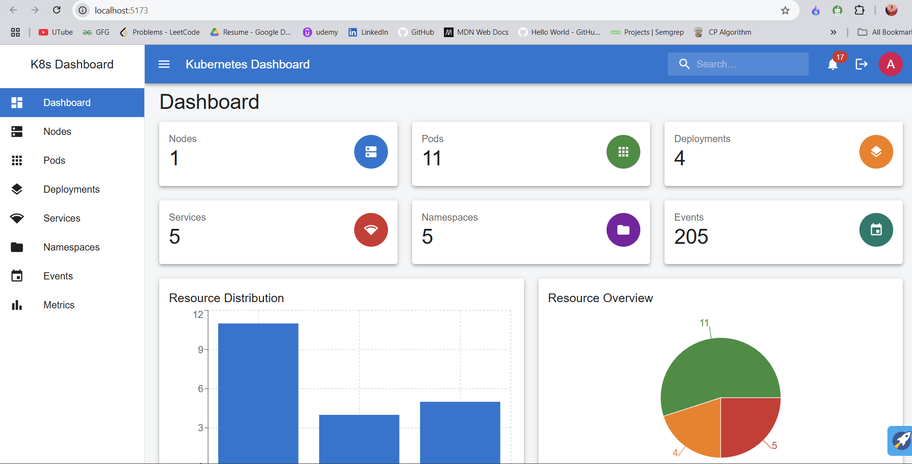

# K8s GUI - Kubernetes Management Interface

A modern web-based GUI for managing Kubernetes clusters, built with React frontend and Go backend.

## 🚀 Quick Start

This guide will help you get both the frontend and backend running on your local machine.

## 📋 Prerequisites

Before you begin, make sure you have the following installed:

- **Node.js** (v16 or later) - [Download here](https://nodejs.org/)
- **Go** (v1.19 or later) - [Download here](https://golang.org/dl/)
- **kubectl** - [Installation guide](https://kubernetes.io/docs/tasks/tools/)
- **A Kubernetes cluster** (local like Minikube, Docker Desktop, or remote)

## 🏗️ Project Structure

```
k8s_GUI/
├── k8s_frontend/          # React frontend application
├── server/                # Go backend API server
├── README.md              # This file
└── package.json           # Root package.json
```

## 🔧 Backend Setup

### 1. Navigate to the server directory
```bash
cd server
```

### 2. Install Go dependencies
```bash
go mod download
go mod tidy
```

### 3. Run the backend server

**Option A: Using Makefile (Recommended)**
```bash
make run
```

**Option B: Direct Go command**
```bash
go run cmd/api/main.go
```

**Option C: Development mode with hot reload**
```bash
make dev
```

The backend server will start on `http://localhost:8080`

### 4. Verify backend is running
Open your browser and visit: `http://localhost:8080/api/clusters`

You should see a JSON response with cluster information.

## 🎨 Frontend Setup

### 1. Navigate to the frontend directory
```bash
cd k8s_frontend
```

### 2. Install Node.js dependencies
```bash
npm install
```

### 3. Start the development server
```bash
npm run dev
```

The frontend will start on `http://localhost:5173` (or another port if 5173 is busy)

### 4. Open the application
Open your browser and visit: `http://localhost:5173`

## 🔐 Authentication

The application uses JWT-based authentication. You can:

1. **Login** with any credentials (demo mode)
2. **Use the token** returned from login for subsequent requests

## 📊 Features

### Backend API Endpoints
- **Authentication**: Login and token verification
- **Cluster**: Health checks and version info
- **Pods**: List, get, delete, and view logs
- **Deployments**: Full CRUD operations
- **Services**: Create, list, get, and delete
- **Namespaces**: Manage Kubernetes namespaces
- **Nodes**: View cluster nodes and their status
- **Events**: Monitor cluster events
- **Metrics**: Resource usage metrics (requires metrics-server)

### Frontend Features
- **Dashboard**: Overview of cluster resources
- **Resource Management**: Manage pods, deployments, services
- **Real-time Monitoring**: View logs and metrics
- **Responsive Design**: Works on desktop and mobile

## 🔧 Configuration

### Backend Configuration

Create a `.env` file in the `server` directory:

```env
PORT=8080
HOST=localhost
KUBECONFIG_PATH=~/.kube/config
JWT_SECRET=your-secret-key-here
JWT_EXPIRY=24h
CORS_ALLOWED_ORIGINS=http://localhost:3000,http://localhost:5173
LOG_LEVEL=info
DEBUG=true
```

### Frontend Configuration

The frontend automatically connects to `http://localhost:8080` for the API. If you need to change this, modify the API base URL in the frontend configuration.

## 🐳 Docker Support

### Backend Docker
```bash
cd server
make docker-build
make docker-run
```

### Frontend Docker
```bash
cd k8s_frontend
docker build -t k8s-gui-frontend .
docker run -p 3000:3000 k8s-gui-frontend
```

## 🚨 Troubleshooting

### Common Issues

1. **Backend won't start**
   - Check if port 8080 is available
   - Ensure kubectl is configured: `kubectl cluster-info`
   - Verify Go installation: `go version`

2. **Frontend won't start**
   - Check if Node.js is installed: `node --version`
   - Clear npm cache: `npm cache clean --force`
   - Delete node_modules and reinstall: `rm -rf node_modules && npm install`

3. **Authentication issues**
   - Check if backend is running on port 8080
   - Verify CORS settings in backend
   - Check browser console for errors

4. **No data showing**
   - Ensure kubectl has access to your cluster
   - Check if your cluster has resources (pods, deployments, etc.)
   - Verify the backend can connect to Kubernetes

### Getting Help

If you encounter issues:

1. Check the browser console for frontend errors
2. Check the backend logs for API errors
3. Verify your Kubernetes cluster is accessible: `kubectl get nodes`
4. Ensure both frontend and backend are running on the correct ports

## 📝 API Documentation

The backend provides RESTful APIs for Kubernetes resource management. All endpoints are prefixed with `/api/` and require authentication (except login).

### Example API calls:
```bash
# Get cluster info
curl -H "Authorization: Bearer YOUR_TOKEN" http://localhost:8080/api/clusters

# List pods
curl -H "Authorization: Bearer YOUR_TOKEN" http://localhost:8080/api/pods

# Get specific pod
curl -H "Authorization: Bearer YOUR_TOKEN" http://localhost:8080/api/pods/default/my-pod
```

## 🤝 Contributing

1. Fork the repository
2. Create a feature branch
3. Make your changes
4. Add tests if applicable
5. Submit a pull request

## 📄 License

This project is licensed under the MIT License.

---

**Happy Kubernetes Management! 🎉**


