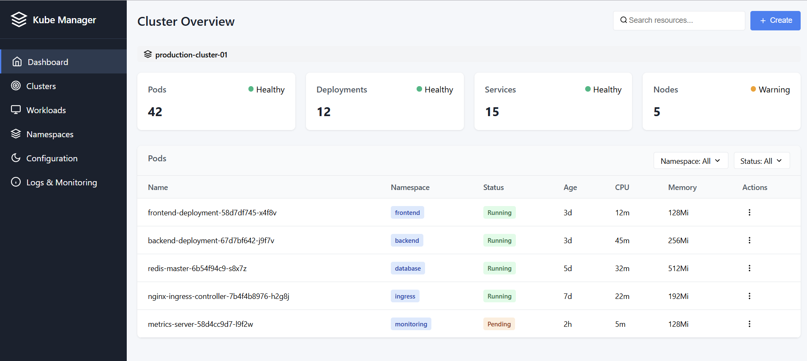

<<<<<<< HEAD
# 🚀 Kubernetes GUI - Modern Web-Based Kubernetes Management Dashboard

<div align="center">
=======
# K8s GUI - Kubernetes Management Interface

A modern web-based GUI for managing Kubernetes clusters, built with React frontend and Go backend.

## 🚀 Quick Start

This guide will help you get both the frontend and backend running on your local machine.

## 📋 Prerequisites

Before you begin, make sure you have the following installed:

- **Node.js** (v16 or later) - [Download here](https://nodejs.org/)
- **Go** (v1.19 or later) - [Download here](https://golang.org/dl/)
- **kubectl** - [Installation guide](https://kubernetes.io/docs/tasks/tools/)
- **A Kubernetes cluster** (local like Minikube, Docker Desktop, or remote)

## 🏗️ Project Structure

```
k8s_GUI/
├── k8s_frontend/          # React frontend application
├── server/                # Go backend API server
├── README.md              # This file
└── package.json           # Root package.json
```

## 🔧 Backend Setup

### 1. Navigate to the server directory
```bash
cd server
```

### 2. Install Go dependencies
```bash
go mod download
go mod tidy
```

### 3. Run the backend server

**Option A: Using Makefile (Recommended)**
```bash
make run
```

**Option B: Direct Go command**
```bash
go run cmd/api/main.go
```

**Option C: Development mode with hot reload**
```bash
make dev
```

The backend server will start on `http://localhost:8080`

### 4. Verify backend is running
Open your browser and visit: `http://localhost:8080/api/clusters`

You should see a JSON response with cluster information.

## 🎨 Frontend Setup

### 1. Navigate to the frontend directory
```bash
cd k8s_frontend
```

### 2. Install Node.js dependencies
```bash
npm install
```

### 3. Start the development server
```bash
npm run dev
```

The frontend will start on `http://localhost:5173` (or another port if 5173 is busy)

### 4. Open the application
Open your browser and visit: `http://localhost:5173`

## 🔐 Authentication

The application uses JWT-based authentication. You can:

1. **Login** with any credentials (demo mode)
2. **Use the token** returned from login for subsequent requests

## 📊 Features

### Backend API Endpoints
- **Authentication**: Login and token verification
- **Cluster**: Health checks and version info
- **Pods**: List, get, delete, and view logs
- **Deployments**: Full CRUD operations
- **Services**: Create, list, get, and delete
- **Namespaces**: Manage Kubernetes namespaces
- **Nodes**: View cluster nodes and their status
- **Events**: Monitor cluster events
- **Metrics**: Resource usage metrics (requires metrics-server)

### Frontend Features
- **Dashboard**: Overview of cluster resources
- **Resource Management**: Manage pods, deployments, services
- **Real-time Monitoring**: View logs and metrics
- **Responsive Design**: Works on desktop and mobile

## 🔧 Configuration

### Backend Configuration

Create a `.env` file in the `server` directory:

```env
PORT=8080
HOST=localhost
KUBECONFIG_PATH=~/.kube/config
JWT_SECRET=your-secret-key-here
JWT_EXPIRY=24h
CORS_ALLOWED_ORIGINS=http://localhost:3000,http://localhost:5173
LOG_LEVEL=info
DEBUG=true
```

### Frontend Configuration

The frontend automatically connects to `http://localhost:8080` for the API. If you need to change this, modify the API base URL in the frontend configuration.

## 🐳 Docker Support

### Backend Docker
```bash
cd server
make docker-build
make docker-run
```

### Frontend Docker
```bash
cd k8s_frontend
docker build -t k8s-gui-frontend .
docker run -p 3000:3000 k8s-gui-frontend
```

## 🚨 Troubleshooting

### Common Issues

1. **Backend won't start**
   - Check if port 8080 is available
   - Ensure kubectl is configured: `kubectl cluster-info`
   - Verify Go installation: `go version`

2. **Frontend won't start**
   - Check if Node.js is installed: `node --version`
   - Clear npm cache: `npm cache clean --force`
   - Delete node_modules and reinstall: `rm -rf node_modules && npm install`

3. **Authentication issues**
   - Check if backend is running on port 8080
   - Verify CORS settings in backend
   - Check browser console for errors

4. **No data showing**
   - Ensure kubectl has access to your cluster
   - Check if your cluster has resources (pods, deployments, etc.)
   - Verify the backend can connect to Kubernetes

### Getting Help

If you encounter issues:

1. Check the browser console for frontend errors
2. Check the backend logs for API errors
3. Verify your Kubernetes cluster is accessible: `kubectl get nodes`
4. Ensure both frontend and backend are running on the correct ports

## 📝 API Documentation

The backend provides RESTful APIs for Kubernetes resource management. All endpoints are prefixed with `/api/` and require authentication (except login).

### Example API calls:
```bash
# Get cluster info
curl -H "Authorization: Bearer YOUR_TOKEN" http://localhost:8080/api/clusters

# List pods
curl -H "Authorization: Bearer YOUR_TOKEN" http://localhost:8080/api/pods

# Get specific pod
curl -H "Authorization: Bearer YOUR_TOKEN" http://localhost:8080/api/pods/default/my-pod
```

## 🤝 Contributing

1. Fork the repository
2. Create a feature branch
3. Make your changes
4. Add tests if applicable
5. Submit a pull request

## 📄 License

This project is licensed under the MIT License.

---

**Happy Kubernetes Management! 🎉**
>>>>>>> fad10af835c9a300e9e6810badef4448210b4ded



[](https://golang.org/)
[](https://reactjs.org/)
[](https://mui.com/)
[](LICENSE)

**A modern, responsive web-based dashboard for managing Kubernetes clusters with real-time metrics, authentication, and comprehensive resource management.**

<<<<<<< HEAD
[🚀 Live Demo](#live-demo) • [📋 Features](#features) • [🛠️ Installation](#installation) • [📖 Usage](#usage) • [🏗️ Architecture](#architecture)

</div>

---

## 📋 Table of Contents

- [🎯 Overview](#-overview)
- [✨ Features](#-features)
- [🖥️ Screenshots & Features](#️-screenshots--features)
- [🛠️ Installation](#️-installation)
- [📖 Usage Guide](#-usage-guide)
- [🏗️ Architecture](#️-architecture)
- [🔧 Configuration](#-configuration)
- [🤝 Contributing](#-contributing)
- [📄 License](#-license)

---

## 🎯 Overview

The Kubernetes GUI is a comprehensive web-based dashboard that provides an intuitive interface for managing Kubernetes clusters. Built with React frontend and Go backend, it offers real-time monitoring, resource management, and secure authentication.

### Key Highlights

- 🔐 **Secure Authentication** - JWT-based login system
- 📊 **Real-time Monitoring** - Live metrics and resource tracking
- 🎨 **Modern UI** - Material-UI based responsive design
- 🔍 **Global Search** - Search across all Kubernetes resources
- 📱 **Responsive Design** - Works on desktop, tablet, and mobile
- ⚡ **Performance** - Fast and efficient resource management

---

## ✨ Features

### 🔐 Authentication & Security

- JWT-based authentication system
- Secure token management with automatic expiration
- Session validation and automatic logout
- Role-based access control ready

### 📊 Dashboard & Monitoring

- Real-time cluster overview and health status
- Resource metrics (CPU, Memory, Network)
- Interactive charts and visualizations
- Performance monitoring at node and pod levels

### 🏗️ Resource Management

- **Pods**: View, create, delete, and monitor pods
- **Deployments**: Manage deployment configurations and scaling
- **Services**: Service discovery and load balancing
- **Nodes**: Cluster node monitoring and management
- **Namespaces**: Multi-tenant resource organization
- **Events**: Real-time cluster event monitoring

### 🎨 User Experience

- Responsive design for all devices
- Material-UI components for modern look
- Real-time updates and notifications
- Intuitive sidebar navigation
- Global search functionality

---

## 🖥️ Screenshots & Features

### 🔐 1. Authentication System

**Login Interface**


**Features:**

- Clean, modern login form
- Default credentials: `admin` / `password`
- Secure JWT token generation
- Automatic session management
- Error handling for invalid credentials

**Session Management:**

- Automatic token validation
- Session expiration handling
- Secure logout functionality
- Visual session status indicator

### 📊 2. Dashboard Overview

**Main Dashboard**


**Features:**

- Cluster health overview
- Resource utilization charts
- Quick access to key metrics
- Real-time status updates
- Navigation to all sections

### 🔍 3. Global Search

**Search Functionality**


**Features:**

- Search across all Kubernetes resources
- Real-time search results
- Resource type indicators
- Quick navigation to resources
- Status chips for each result

**Search Capabilities:**

- Search by resource name
- Search by namespace
- Filter by resource type (Pods, Deployments, Services, Nodes)
- Click to navigate to resource details

### 📦 4. Pods Management

**Pods List View**


**Features:**

- Complete pod listing with status
- Pod details and logs viewing
- Pod deletion functionality
- Status indicators (Running, Pending, Failed, etc.)
- Age and restart count tracking

**Pod Operations:**

- View pod details
- Access pod logs
- Delete pods
- Monitor pod status
- View container information

### 🚀 5. Deployments Management

**Deployments View**


**Features:**

- Deployment listing and status
- Replica management
- Deployment scaling
- Configuration updates
- Health monitoring

### 🌐 6. Services Management

**Services Overview**


**Features:**

- Service discovery
- Load balancing configuration
- Port and protocol management
- Service type indicators
- Endpoint monitoring

### 🖥️ 7. Nodes Management

**Nodes Overview**


**Features:**

- Node health monitoring
- Resource capacity tracking
- Node metrics and performance
- OS and version information
- Allocatable resources

### 📁 8. Namespaces Management

**Namespaces View**


**Features:**

- Namespace organization
- Resource isolation
- Multi-tenant support
- Namespace creation and deletion
- Resource quotas

### 📈 9. Metrics & Monitoring

**Metrics Dashboard**


**Features:**

- Real-time performance metrics
- CPU and memory utilization
- Network statistics
- Interactive charts
- Historical data tracking

### 🔔 10. Events & Notifications

**Events Monitoring**


**Features:**

- Real-time event monitoring
- Event filtering and search
- Notification system
- Event history tracking
- Alert management

---

## 🛠️ Installation

### Prerequisites

- **Go 1.20+** - Backend runtime
- **Node.js 16+** - Frontend development
- **Kubernetes Cluster** - Target cluster for management
- **kubectl** - Kubernetes command-line tool (optional)

### Quick Start

1. **Clone the Repository**

   ```bash
   git clone https://github.com/yourusername/kubernetes-gui.git
   cd kubernetes-gui
   ```

2. **Backend Setup**

   ```bash
   cd server

   # Create environment file
   cat > .env << EOF
   PORT=8081
   JWT_SECRET=your_super_secret_jwt_key_here
   EOF

   # Install dependencies
   go mod tidy

   # Run the backend
   go run cmd/backend/main.go
   ```

3. **Frontend Setup**

   ```bash
   cd k8s_frontend

   # Install dependencies
   npm install

   # Start development server
   npm run dev
   ```

4. **Access the Application**
   - Frontend: http://localhost:5173
   - Backend API: http://localhost:8081
   - Default credentials: `admin` / `password`

### Production Deployment

1. **Build Frontend**

   ```bash
   cd k8s_frontend
   npm run build
   ```

2. **Build Backend**

   ```bash
   cd server
   go build -o k8s-gui cmd/backend/main.go
   ```

3. **Environment Configuration**
   ```bash
   # Production .env
   PORT=8081
   JWT_SECRET=your_production_jwt_secret_key
   ```

---

## 📖 Usage Guide

### 🔐 Authentication

1. **Login Process**

   - Navigate to the application URL
   - Enter credentials: `admin` / `password`
   - Click "Sign In" to authenticate
   - JWT token is automatically stored and managed

2. **Session Management**
   - Session automatically validates every 5 minutes
   - Automatic logout on session expiration
   - Visual session status indicator in header
   - Manual logout available via header button

### 📊 Dashboard Navigation

1. **Main Dashboard**

   - View cluster overview and health
   - Access quick metrics and statistics
   - Navigate to different resource sections

2. **Sidebar Navigation**
   - **Dashboard**: Main overview page
   - **Nodes**: Cluster node management
   - **Pods**: Pod monitoring and management
   - **Deployments**: Application deployment management
   - **Services**: Service networking
   - **Namespaces**: Resource organization
   - **Events**: Cluster event monitoring
   - **Metrics**: Performance metrics

### 🔍 Global Search

1. **Using Search**

   - Click the search bar in the header
   - Type resource name or namespace
   - View real-time search results
   - Click on result to navigate

2. **Search Features**
   - Searches across all resource types
   - Shows resource status and type
   - Provides quick navigation
   - Filters results by type

### 📦 Resource Management

1. **Pods Management**

   - View all pods in the cluster
   - Check pod status and health
   - Access pod logs and details
   - Delete pods when needed

2. **Deployments Management**

   - Monitor deployment status
   - Scale deployments up/down
   - Update deployment configurations
   - View deployment history

3. **Services Management**

   - Configure service networking
   - Manage load balancing
   - Monitor service endpoints
   - Update service configurations

4. **Nodes Management**
   - Monitor node health
   - View resource utilization
   - Check node capacity
   - Monitor node performance

### 📈 Monitoring & Metrics

1. **Real-time Metrics**

   - Monitor CPU and memory usage
   - Track network statistics
   - View performance trends
   - Analyze resource utilization

2. **Event Monitoring**
   - Track cluster events
   - Monitor resource changes
   - View error notifications
   - Analyze event patterns

---

## 🏗️ Architecture

### Frontend Architecture

```
k8s_frontend/
├── src/
│   ├── components/          # Reusable UI components
│   │   ├── Header.jsx      # Navigation and search
│   │   ├── Sidebar.jsx     # Main navigation
│   │   └── Login.jsx       # Authentication
│   ├── pages/              # Main application pages
│   │   ├── Dashboard.jsx   # Main dashboard
│   │   ├── Pods.jsx        # Pods management
│   │   ├── Deployments.jsx # Deployments management
│   │   └── ...             # Other resource pages
│   ├── hooks/              # Custom React hooks
│   │   └── useSession.js   # Session management
│   └── App.jsx             # Main application component
```

### Backend Architecture

```
server/
├── cmd/backend/
│   └── main.go             # Application entry point
├── internal/
│   ├── api/                # API handlers
│   │   └── handlers.go     # Resource management endpoints
│   ├── auth/               # Authentication
│   │   └── auth.go         # JWT authentication
│   ├── k8s/                # Kubernetes client
│   │   └── client.go       # K8s client initialization
│   └── server/             # Server configuration
│       └── router.go       # Route definitions
```

### Technology Stack

- **Frontend**: React 18, Material-UI, Vite
- **Backend**: Go, Gorilla Mux, JWT
- **Database**: Kubernetes API (stateless)
- **Authentication**: JWT tokens
- **Styling**: Material-UI components

---

## 🔧 Configuration

### Environment Variables

```bash
# Server Configuration
PORT=8081                    # Server port
JWT_SECRET=your_secret_key   # JWT signing secret

# Kubernetes Configuration
KUBECONFIG=/path/to/kubeconfig  # K8s config path (optional)
```

### Frontend Configuration

```javascript
// vite.config.js
export default defineConfig({
  server: {
    proxy: {
      "/api": "http://localhost:8081",
    },
  },
});
```

### Security Configuration

1. **JWT Secret**: Use a strong, unique secret key
2. **HTTPS**: Enable HTTPS in production
3. **CORS**: Configure CORS settings for your domain
4. **Rate Limiting**: Implement rate limiting for API endpoints

---

## 🤝 Contributing

We welcome contributions! Please follow these steps:

1. **Fork the repository**
2. **Create a feature branch**: `git checkout -b feature/amazing-feature`
3. **Commit your changes**: `git commit -m 'Add amazing feature'`
4. **Push to the branch**: `git push origin feature/amazing-feature`
5. **Open a Pull Request**

### Development Guidelines

- Follow Go and React best practices
- Add tests for new features
- Update documentation for changes
- Ensure code quality and formatting

---

## 📄 License

This project is licensed under the MIT License - see the [LICENSE](LICENSE) file for details.

---

## 🙏 Acknowledgments

- [Kubernetes](https://kubernetes.io/) - Container orchestration platform
- [React](https://reactjs.org/) - Frontend framework
- [Material-UI](https://mui.com/) - UI component library
- [Go](https://golang.org/) - Backend programming language

---

<div align="center">

**Made with ❤️ for the Kubernetes community**

[⭐ Star this repo](https://github.com/yourusername/kubernetes-gui) • [🐛 Report issues](https://github.com/yourusername/kubernetes-gui/issues) • [📖 Documentation](https://github.com/yourusername/kubernetes-gui/wiki)

</div>
=======
>>>>>>> fad10af835c9a300e9e6810badef4448210b4ded
